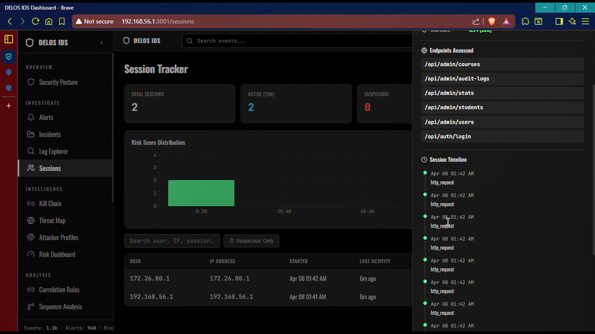

# DELOS ERP IDPS

Public case study for a final-year ERP Intrusion Detection and Prevention System.

DELOS ERP IDPS is a full-stack security product prototype for protecting ERP workflows with a middleware gateway, ML-assisted intrusion detection, risk scoring, incident correlation, and a SOC-style monitoring dashboard.

> The complete source code is private. This public repository contains the portfolio-safe case study: architecture, screenshots, security design, demo flow, and project explanation.

## Why This Project Exists

ERP systems contain academic, financial, operational, and identity data. Traditional ERP applications usually log activity after the fact, but they rarely inspect traffic in real time, correlate suspicious behavior across modules, or adapt defenses based on current risk.

This project explores how an ERP platform can be protected by placing a security-aware middleware layer between the user-facing ERP portal and backend services. Requests are inspected, normalized into security events, analyzed by an IDS engine, correlated into incidents, and surfaced in an admin dashboard for investigation.

## Highlights

- Built a multi-service ERP security platform with separate ERP, middleware, IDS, ERP frontend, and admin dashboard services.
- Designed a middleware gateway for request inspection, rate limiting, blocking, SIEM-style event ingestion, WebSocket alert fanout, and IDS proxying.
- Implemented an ML-assisted detection pipeline with binary attack detection, multiclass categorization, anomaly scoring, and risk-based decisions.
- Built SOC-style admin views for security posture, incidents, sessions, sequence analysis, attacker profiles, correlation rules, model health, and pipeline monitoring.
- Added ERP-aware profiling for academic, healthcare, industrial, retail, and corporate ERP contexts.
- Prepared local, container, and Kubernetes-oriented deployment designs in the private implementation.

## System Architecture

The system is split into clear runtime responsibilities:

| Component | Responsibility |
| --- | --- |
| ERP frontend | Student/admin ERP portal used by normal users |
| Admin dashboard | SOC-style interface for monitoring and response |
| ERP service | Core ERP APIs, authentication, student/admin workflows |
| Middleware service | Security gateway, request inspection, rate limiting, blocking, IDS proxying |
| IDS service | ML inference, anomaly detection, risk scoring, correlation, feedback |
| Persistence layer | Alerts, incidents, risk scores, SIEM events, audit records |

## Screenshots

### Security Posture

The Security Posture view gives the operator a single command view of current exposure: posture score, alert severity, evidence freshness, service readiness, middleware readiness, IDS readiness, and SOC actions.

### Incident Management

Incidents group related detections into investigation records with severity, status, source IPs, event count, creation time, and duration.

### Session Analysis

The session tracker connects application behavior with security telemetry by showing suspicious sessions, risk distribution, endpoints accessed, and per-session activity timelines.

### Detection Pipeline

The pipeline monitor shows detection stages such as binary classification, multiclass classification, anomaly detection, and meta-model decisioning.

### ERP Prevention Flow

The prevention flow demonstrates how a blocked source is stopped before reaching protected ERP workflows.

## Detection and Response Design

The detection pipeline combines:

- WAF-style request checks for suspicious payloads and patterns.
- Adaptive rate limiting based on source behavior and risk.
- ML-assisted classification and anomaly scoring.
- ERP-domain sensitivity scoring for critical modules and actions.
- Incident correlation for repeated or multi-stage behavior.
- Admin feedback loops for false positives and response tuning.

## Portfolio Value

This project is meant to show more than a model notebook. It demonstrates:

- Full-stack product thinking.
- Backend API design.
- Security middleware design.
- Applied ML system integration.
- SOC dashboard UX.
- Data modeling and persistence.
- Deployment awareness.
- Practical security tradeoffs and hardening planning.

## Documentation

- [Architecture](docs/ARCHITECTURE.md)
- [Security Design](docs/SECURITY_DESIGN.md)
- [Demo Walkthrough](docs/DEMO_WALKTHROUGH.md)
- [Interview Notes](docs/INTERVIEW_NOTES.md)

## Source Code Availability

The full implementation is private because it contains backend logic, security workflows, deployment structure, schema design, and implementation details that should be shared selectively.

For interviews or formal review, I can walk through the code live or provide temporary access if appropriate.

## Tech Stack

| Area | Tools |
| --- | --- |
| Frontend | React, Vite, React Router, Axios, Recharts, Leaflet |
| Backend | Flask, FastAPI, SQLAlchemy, Pydantic |
| Security | Middleware inspection, WAF checks, adaptive rate limiting, IP blocking, incident correlation |
| ML | scikit-learn, NumPy, trained classifiers, anomaly detection, threshold tuning |
| Database | SQLite fallback, Supabase/PostgreSQL-oriented schema |
| Deployment | Docker, Docker Compose, Kubernetes-oriented manifests |

## Status

Final-year project case study. The public repository is intentionally documentation-only.
