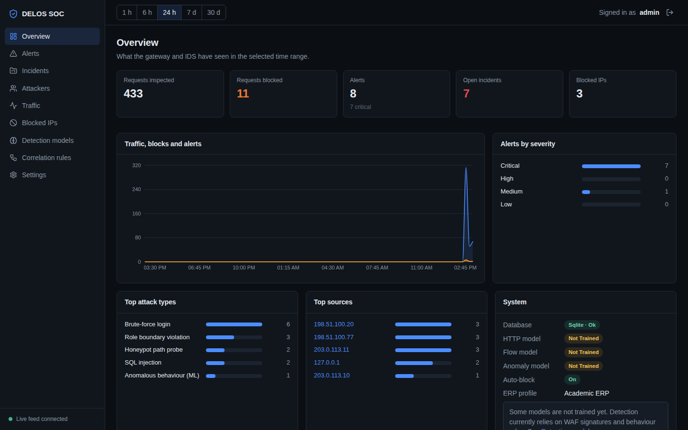
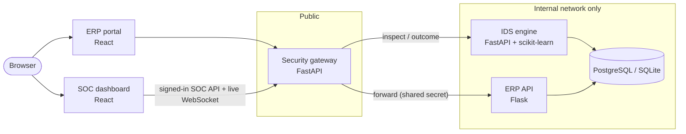
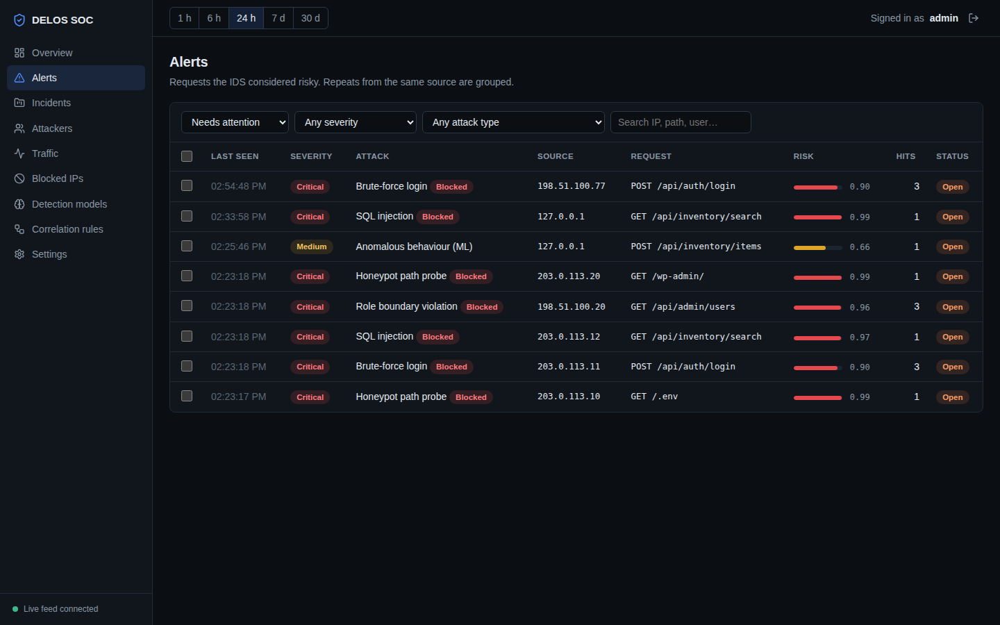
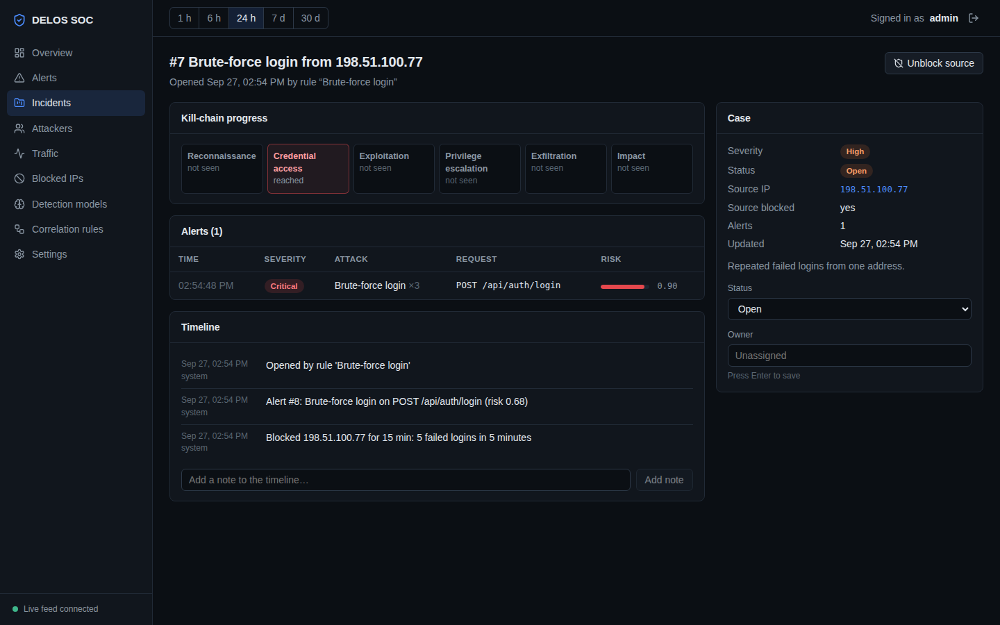
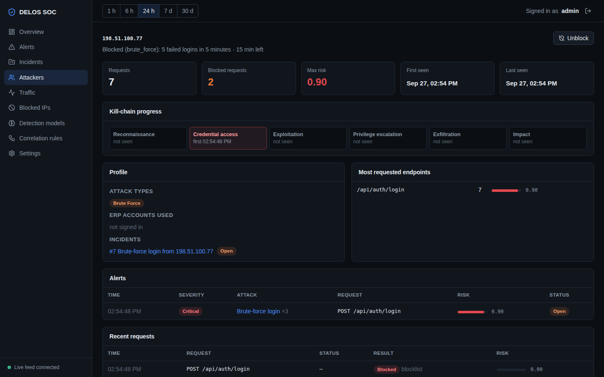
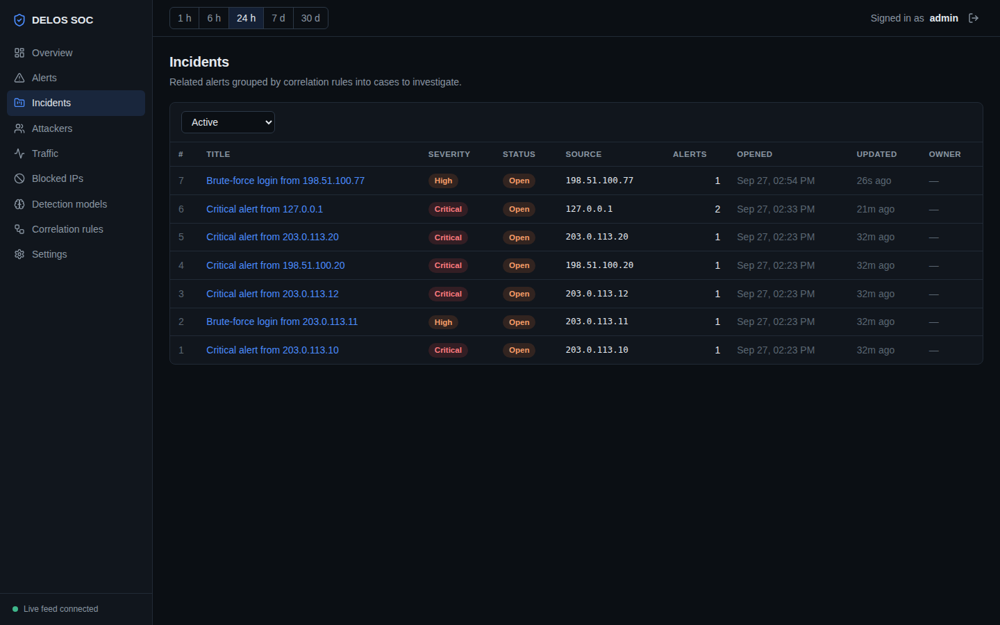
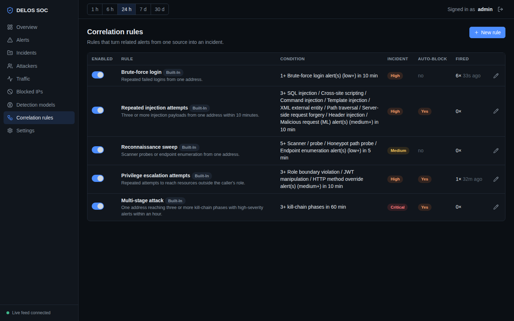
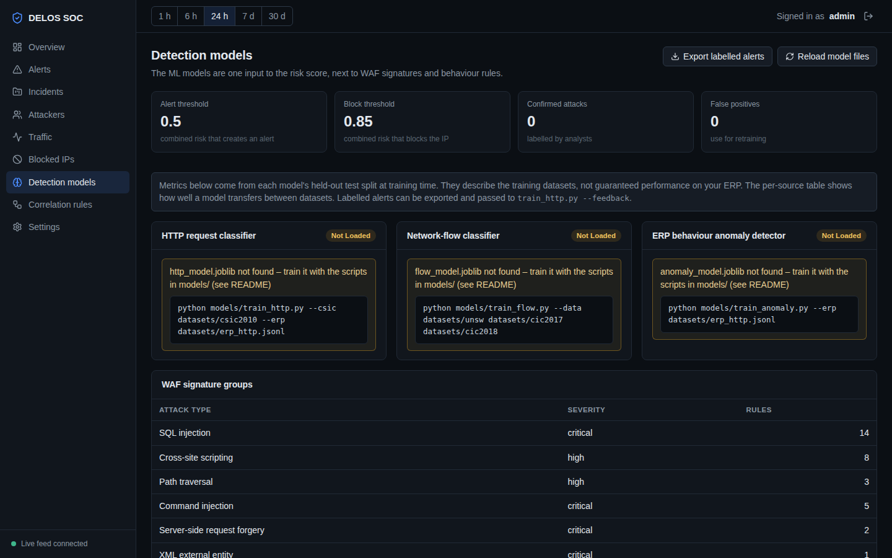
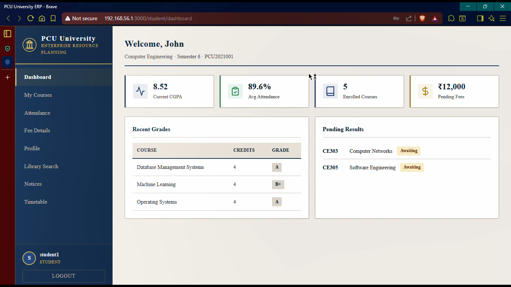

# DELOS ERP-IDPS

**An intrusion detection and prevention system for a university ERP.**
A security gateway sits in front of the ERP. It inspects every request with signature rules,
behaviour checks and ML models, blocks attacks before they reach the ERP, and streams alerts,
incidents and blocked IPs to a live SOC dashboard.




> **This is a public case study.** The source code is in a private repository. This repo documents
> the architecture, security design, engineering decisions and screenshots of the working system.
> I can walk through the code live or grant temporary access for a formal review.

---

## At a glance

| | |
|---|---|
| **What** | A gateway + IDS that protects an ERP (students, faculty, admin, library) and a SOC dashboard to operate it |
| **Services** | 5 — security gateway, IDS engine, ERP API, ERP portal, SOC dashboard |
| **Detection** | WAF signatures · gateway checks (honeypots, rate limits, brute force) · ERP role rules · 3 ML models |
| **Decision** | Explainable evidence scoring (noisy-OR), evidence-gated auto-block, rule-based incident correlation |
| **Tests** | 94 automated tests (pytest) covering WAF, features, detection, correlation, gateway pipeline and ERP permissions |
| **Deploy** | Local script, Docker Compose, Kubernetes manifests; SQLite for demos, PostgreSQL/Supabase for shared use |
| **Role** | Final-year engineering project — designed and built end to end |

## The problem

ERP systems hold high-value data: identities, grades, attendance, fees, admin actions. A typical
ERP authenticates users and writes logs, but nothing watches traffic in real time, links related
suspicious events together, or stops an attacker mid-attempt.

DELOS puts a security-aware gateway in front of the ERP so that **every request is inspected before
it reaches business logic**, and gives an operator a SOC view to investigate and respond.

## Architecture



| Service | Role |
|---|---|
| **Security gateway** | The only public entry point. Block list, honeypots, rate limits, WAF, IDS check, then proxies to the ERP. Also serves the SOC API and the live alert WebSocket. |
| **IDS engine** | ML models, behaviour detectors, ERP role rules, risk scoring, alerts, incidents, auto-block, Telegram notifications. Internal only. |
| **ERP API** | The protected ERP. Rejects any request that did not come through the gateway. Internal only. |
| **ERP portal** | Student, faculty and admin workflows: courses, attendance, fees, library, notices, audit logs. |
| **SOC dashboard** | Overview, alerts, incidents, attackers, traffic, blocked IPs, detection models, correlation rules, settings. |

Details: [Architecture](docs/ARCHITECTURE.md)

## How a request is handled

Cheap checks run first, so an attacker who is already blocked costs almost nothing to turn away.
After the ERP responds, the outcome (status, latency) goes back to the IDS; that is what drives
the brute-force and enumeration detectors.

| # | Step | If it fails |
|---|---|---|
| 1 | **Block list**: is this source already blocked? | 403 |
| 2 | **Honeypot paths**: `/.env`, `/wp-admin`, … | 403, source blocked immediately |
| 3 | **Rate limits**: per signed-in user, else per IP | 429 |
| 4 | **WAF signatures**: double-decoded input | 403 on a blocking match; scripted clients are only flagged |
| 5 | **IDS inspect**: features, user and role → `allow` / `flag` / `block` + risk | 403 on block |
| 6 | **Forward to the ERP**, then report the outcome to the IDS | — |

## Detection and risk scoring

Each detector returns **evidence**: a score, a weight, an attack type and a human-readable reason.
Evidence is combined with a noisy-OR:

```
risk = 1 − ∏ (1 − scoreᵢ · weightᵢ)
```

| Evidence source | Weight | Catches |
|---|---|---|
| WAF signatures | 1.0 | SQLi, XSS, command injection, path traversal, SSRF, XXE, template injection, JWT `alg=none`, known scanners |
| Gateway checks | 1.0 | Honeypot paths, rate-limit abuse, brute-force logins |
| ERP role rules | 1.0 | A role calling endpoints it may not use; bulk reads above the role's limit |
| HTTP model (primary ML) | 1.0 | Malicious HTTP requests (CSIC-2010 + ERP traffic + analyst feedback) |
| Anomaly model | 0.5 | Requests unlike this ERP's normal traffic |
| Flow model | 0.35 | Network-flow patterns (UNSW-NB15 / CIC-IDS), weak signal by design |

**Why noisy-OR:** one strong signal is enough on its own, weak signals add up slowly, every alert
is explainable item by item, and there is nothing extra to train.

**Auto-block is evidence-gated:** an IP is blocked only when risk crosses the block threshold
**and** at least one strong piece of evidence (a blocking signature, honeypot hit, repeated failed
logins, repeated role violations, or a very confident model) contributes. An anomaly score alone
never blocks anyone.

Alerts are grouped into **incidents** by editable correlation rules (brute force, repeated
injection, reconnaissance sweep, privilege escalation, multi-stage attack) and mapped onto a
kill chain.

Details: [Security design](docs/SECURITY_DESIGN.md)

## Screenshots

### SOC — alerts
Repeats from the same source are grouped. Risk, hit count and block status are visible at a glance.



### SOC — incident investigation
Kill-chain progress, the alerts behind the incident, a system-and-analyst timeline, and case
ownership. One click unblocks the source.



### SOC — attacker profile
Everything known about one source: requests, max risk, kill-chain phases reached, endpoints hit,
ERP accounts used and linked incidents.



<details>
<summary><b>More screenshots</b> — incidents, correlation rules, detection models, ERP portal</summary>

### Incidents


### Correlation rules (editable in the dashboard)


### Detection models and WAF signature groups


### The protected ERP portal


</details>

## Engineering highlights

- **Trust boundaries, not just features.** Only the gateway is public. The ERP refuses traffic
  that bypasses it, the IDS needs an API key, and the browser never holds database credentials.
- **Training/serving parity.** Training scripts and the live IDS import the same feature module.
  Each model stores its feature list, and the IDS refuses to load a model that doesn't match.
- **Fail-safe by environment.** If the IDS is down, the gateway fails open in demo/dev and fails
  closed in production, with a circuit breaker so a dead IDS doesn't slow every request.
- **Spoof-resistant client IPs.** `X-Forwarded-For` is trusted only from configured proxies;
  otherwise an attacker could pick their own IP, dodge blocks, or get someone else blocked.
- **False-positive discipline.** Rate limits are per signed-in user, not per IP (per-IP limits
  wrongly throttled 17% of normal requests from a shared campus NAT in testing). Behaviour alerts
  are merged per source and type so a busy legitimate user doesn't escalate into a critical incident.
  A traffic generator reports how many normal requests were wrongly blocked.
- **Honest ML reporting.** Metrics are reported per data source and leave-one-dataset-out. High
  scores on CSIC-2010 or CIC-IDS are not presented as real-world ERP accuracy.

## What I cut, and why

The project went through a full rewrite. The first version had features that looked impressive
but were not actually wired into the request path. I removed them instead of keeping dead code:

| Removed | Reason |
|---|---|
| Reinforcement-learning "agents" and federated learning | Nothing was trained or used at runtime |
| Drift detection with automatic retraining | Retraining on unlabelled production traffic can teach the model that attacks are normal. Retraining is now manual, with analyst-labelled feedback. |
| Geo map and threat forecast | No GeoIP source or forecasting model behind them |
| Three-level L1/L2/L3 ML pipeline + meta-model | Replaced by one calibrated HTTP model plus anomaly and flow models, combined by explainable evidence scoring |
| Browser-side Supabase access | The old dashboard shipped a database key to the browser; data now flows only through the authenticated gateway |
| Unreproducible accuracy figures | Numbers that could not be reproduced from the code were removed |

More on these decisions: [Design decisions & Q&A](docs/DESIGN_DECISIONS.md)

## Tech stack

| Area | Tools |
|---|---|
| Gateway & IDS | Python 3.11, FastAPI, Pydantic, httpx, Uvicorn |
| ERP | Flask, Flask-JWT-Extended, Gunicorn |
| ML | scikit-learn, NumPy, joblib — datasets: CSIC-2010, UNSW-NB15, CIC-IDS, synthetic ERP traffic |
| Data | SQLAlchemy 2, PostgreSQL (Supabase), SQLite (WAL) fallback |
| Frontends | React 18, Vite, React Router, Recharts, lucide-react, Axios |
| Realtime & alerts | WebSocket live feed, Telegram notifications with one-time-code verification |
| Deployment | Docker, Docker Compose, Kubernetes manifests (namespace, config, backend, frontends, ingress) |
| Quality | pytest (94 tests), ESLint |

## Known limitations

- The gateway and IDS keep rate-limit windows, block cache and behaviour state in memory, so each
  runs as a single process. Horizontal scaling would need a shared store such as Redis.
- The flow model only sees flow features approximated from a single HTTP exchange; it is a weak
  signal and weighted accordingly.
- Trained models are not shipped with the code; they are trained locally from the datasets.
- Telegram is the only notification channel.

## Documentation

| Document | Contents |
|---|---|
| [Architecture](docs/ARCHITECTURE.md) | Services, trust boundaries, request pipeline, data model, deployment, scaling |
| [Security design](docs/SECURITY_DESIGN.md) | Threat model, controls, detection engine, ML, risk scoring, correlation, hardening |
| [Demo walkthrough](docs/DEMO_WALKTHROUGH.md) | The 10-minute demo script I use for reviews |
| [Design decisions & Q&A](docs/DESIGN_DECISIONS.md) | Trade-offs, the v1 → v2 rewrite, and answers to common questions |

## Source code availability

The implementation is private because it contains detection logic, signatures, schema and
deployment details that would give an attacker more than a reviewer needs. For interviews or
formal review I can share my screen and walk through the code, or grant temporary read access.

---

© 2026 zeinitsu03. All rights reserved — see [LICENSE](LICENSE).
