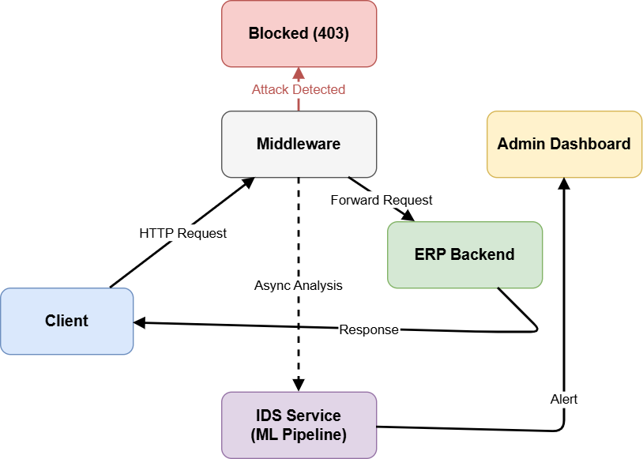
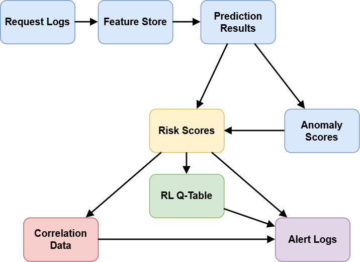
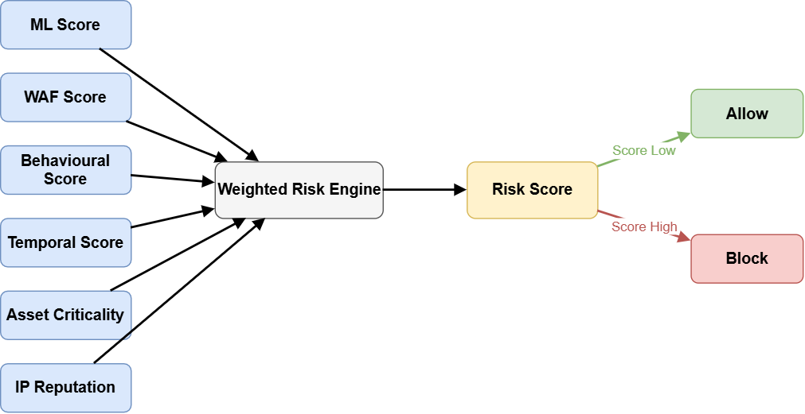
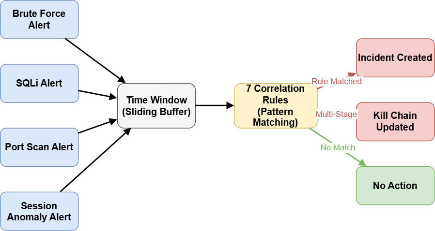
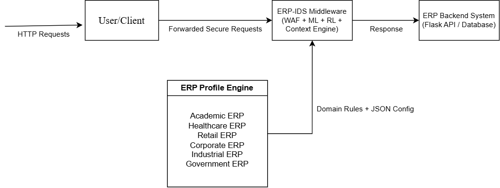

# Architecture

DELOS ERP IDPS is designed as a layered ERP security platform rather than a single IDS model. The main idea is to keep ERP business logic, traffic inspection, detection, and monitoring separated.

## High-Level Flow

1. A user interacts with the ERP portal.
2. Requests go through the middleware gateway instead of directly reaching the ERP service.
3. Middleware checks source behavior, request patterns, endpoint sensitivity, and block state.
4. Safe requests are forwarded to the ERP backend.
5. Security-relevant telemetry is sent to the IDS service.
6. IDS analysis produces alerts, risk scores, incidents, and dashboard events.

## Runtime Components

| Layer | Purpose |
| --- | --- |
| ERP portal | Realistic student/admin ERP workflows |
| Middleware gateway | Inspection, enforcement, request forwarding, alert stream |
| ERP API | Core academic ERP data and actions |
| IDS API | Detection, scoring, correlation, ML pipeline visibility |
| Admin dashboard | SOC-style monitoring and response interface |
| Persistence | Events, alerts, incidents, risk, audit data |

## Database View

The database design supports ERP records, audit trails, SIEM-style events, alerts, incidents, risk scores, and dashboard state.

## Risk and Correlation

Risk scoring combines behavior, endpoint sensitivity, temporal activity, attack indicators, and source reputation. Correlation turns repeated or related alerts into incident-level records.

## ERP-Agnostic Design

The private implementation includes profile concepts for academic, healthcare, industrial, retail, and corporate ERP domains. This allows sensitivity and risk logic to change based on the business context instead of hardcoding only one college ERP scenario.
