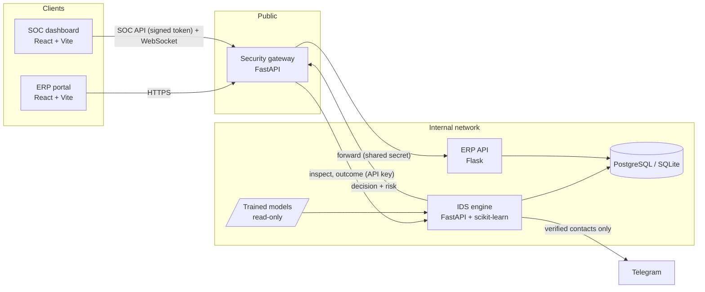
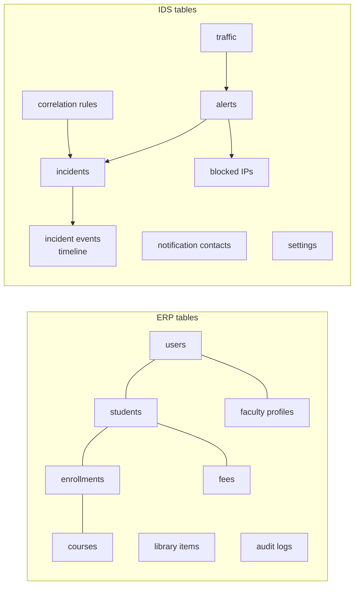

# Architecture

DELOS is a layered system rather than a single IDS model. ERP business logic, traffic
enforcement, detection and monitoring each live in their own service, with explicit trust
boundaries between them.

## Services



| Service | Responsibility |
|---|---|
| Security gateway | Only public entry point. Enforcement pipeline, proxying to the ERP, SOC API, live WebSocket |
| IDS engine | Feature extraction, ML inference, behaviour detectors, ERP role rules, risk scoring, alerts, incidents, correlation, auto-block, notifications |
| ERP API | Students, faculty, admin, courses, enrollments, fees, library, audit logs |
| ERP portal | Role-based UI for students, faculty and admins |
| SOC dashboard | Monitoring, investigation and response UI for security operators |

Code that more than one service needs (settings, database connection, WAF signatures, ML feature
extraction, attack taxonomy, signed tokens) lives in a shared package rather than being copied.

## Trust boundaries

```
browser ──► gateway (public) ──► IDS (internal)
                     └─────────► ERP (internal)
```

- **The gateway is the only public service.** The ERP rejects any request that doesn't carry the
  gateway's shared secret, so nobody can reach the ERP around the IDS.
- **The IDS is internal.** Every IDS call needs an API key. The SOC dashboard never talks to the
  IDS directly: it signs in to the gateway, receives a signed token, and the gateway proxies the
  SOC API. One login and one CORS origin cover the whole dashboard.
- **The database is backend-only.** Frontends never hold database credentials. The first version
  shipped a database key in the browser bundle and relied entirely on row-level-security policies
  being correct; the rewrite removed that exposure.

## Request pipeline

The gateway runs its checks in order of cost:

1. **Block list.** In-memory cache synced from the IDS every few seconds. Blocks the gateway adds
   itself take effect immediately and survive a sync, even while the IDS is unreachable.
2. **Honeypot paths** such as `/.env` or `/wp-admin`. No legitimate user asks for these, so the
   source is blocked straight away.
3. **Rate limits.** Keyed per signed-in user (from a verified token), or per IP for anonymous
   clients.
4. **WAF signatures.** Input is URL-decoded twice so double encoding doesn't slip through.
   Scripted clients (curl, python-requests) are *flagged*, not blocked, because monitoring scripts
   are legitimate too.
5. **IDS inspect.** The gateway sends request features, user and role; the IDS returns
   `allow` / `flag` / `block` plus a risk score.
6. **Forward to the ERP**, then report the **outcome** (status code, latency) to the IDS. Outcomes
   drive the brute-force and enumeration detectors: a 401 on the login endpoint counts as a
   failed login.

### Failure behaviour

| Mode | IDS unreachable | Client IP from `X-Forwarded-For` | Demo data |
|---|---|---|---|
| `demo` | Fail open | Trusted from localhost (to simulate attackers) | Yes |
| `development` | Fail open | Trusted only from configured proxies | Yes |
| `production` | **Fail closed (503)** | Trusted only from configured proxies | No; weak or default secrets are refused at startup |

A circuit breaker stops the gateway from waiting on a dead IDS for every request.

## Live updates

As the gateway processes traffic it publishes live events (each request's outcome, new alerts
returned by the IDS, and blocks) to signed-in dashboards over an authenticated WebSocket. Each
client has a bounded queue, so a slow browser drops old events instead of slowing the gateway.
The dashboard doesn't depend on a database vendor's realtime feature.

## Data model

Both backends create their own tables on startup. Table names are prefixed per service, so the
ERP and the IDS can share one PostgreSQL database without clashing.



- **Traffic** holds every inspected request and is purged after a retention period.
  **Alerts and incidents** are kept.
- **Incident events** form the investigation timeline: system actions and analyst notes.
- **Correlation rules** live in the database, so operators can edit them from the dashboard.
- No migration tool yet. That's acceptable while the schema is young; Alembic would be the next
  step before altering a table that holds data worth keeping.
- SQLite runs in WAL mode with a busy timeout for demos. PostgreSQL/Supabase is used for shared
  deployments. If a PostgreSQL URL is configured but unreachable, the services **stop with an
  explanation** instead of silently falling back to SQLite, which would produce an empty dashboard
  with no clue why.

## Deployment

| Target | Notes |
|---|---|
| Local | One script starts all five services and prints the URLs; SQLite by default |
| Docker Compose | Only the gateway and the two frontends are published. ERP and IDS sit on the internal network. Models are mounted read-only. |
| Kubernetes | Namespace + config, backend deployments, frontends, ingress and network policy. Secrets come from a Kubernetes Secret, not config maps. |

A database diagnostics script checks DNS, TCP, login and tables one step at a time, and prints the
fix for each common failure (wrong pooler username, paused free-tier project, IPv6-only host, wrong
password).

## Scaling limits

Rate-limit windows, failed-login counters, the block cache and IDS behaviour windows live in
process memory. The gateway and the IDS therefore **must run as one process each**. Scaling out
would need a shared store such as Redis. For a single university ERP that is more infrastructure
than it's worth, so it's documented as a known limit rather than half-built.

## ERP domain profiles

Endpoint sensitivity, role permissions and per-role request-rate limits are defined in an ERP
domain configuration instead of being hardcoded. The active profile is the academic ERP. Profiles
for other domains (healthcare, retail, industrial, corporate) exist as configuration examples of
how the same engine would be adapted; only the academic profile is exercised by the ERP in this
project.
