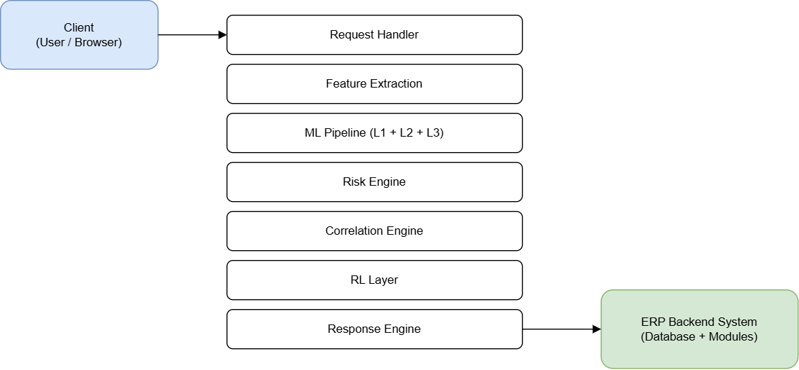
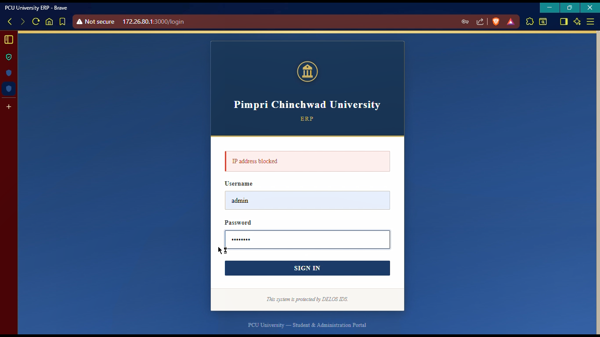
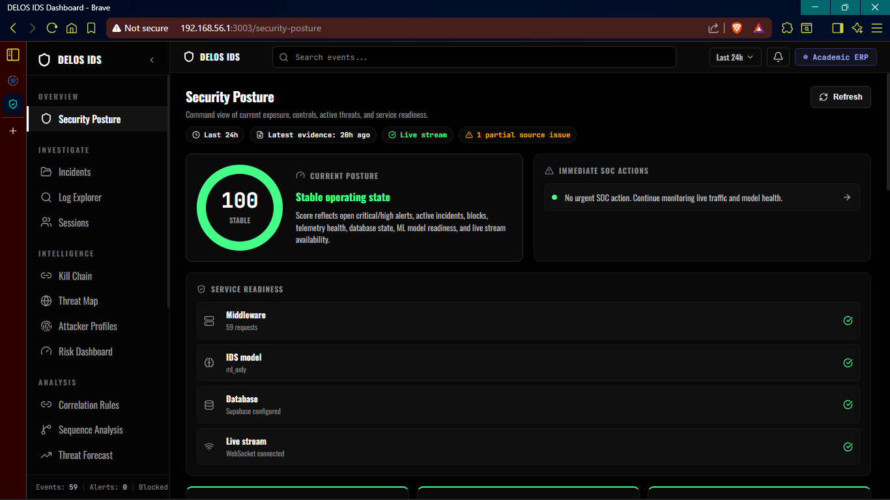
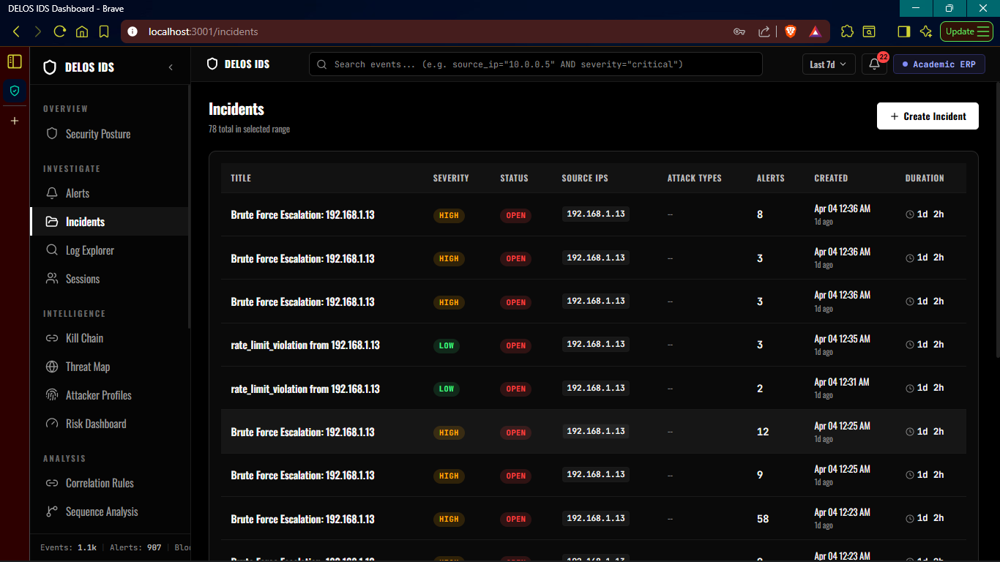
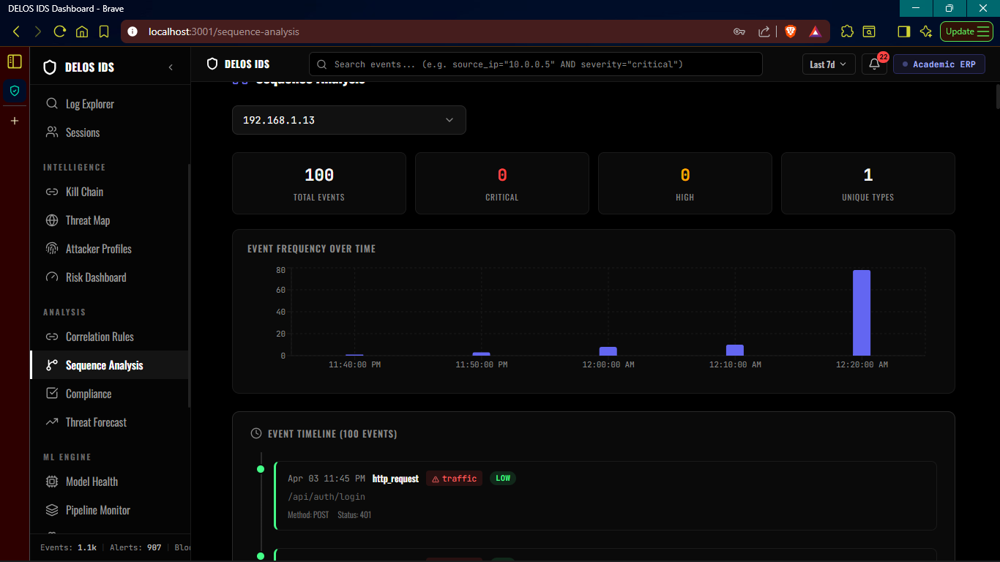
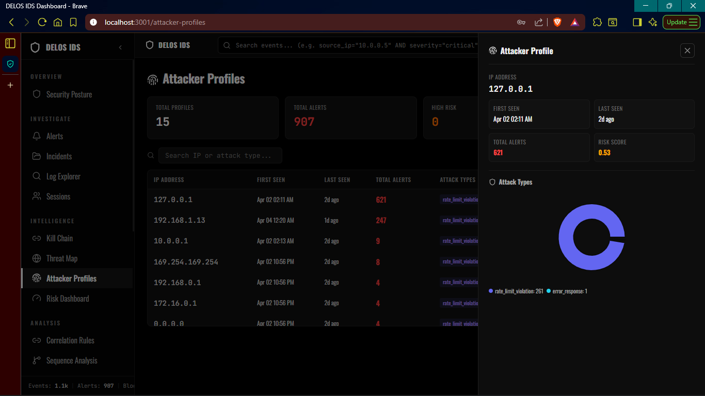
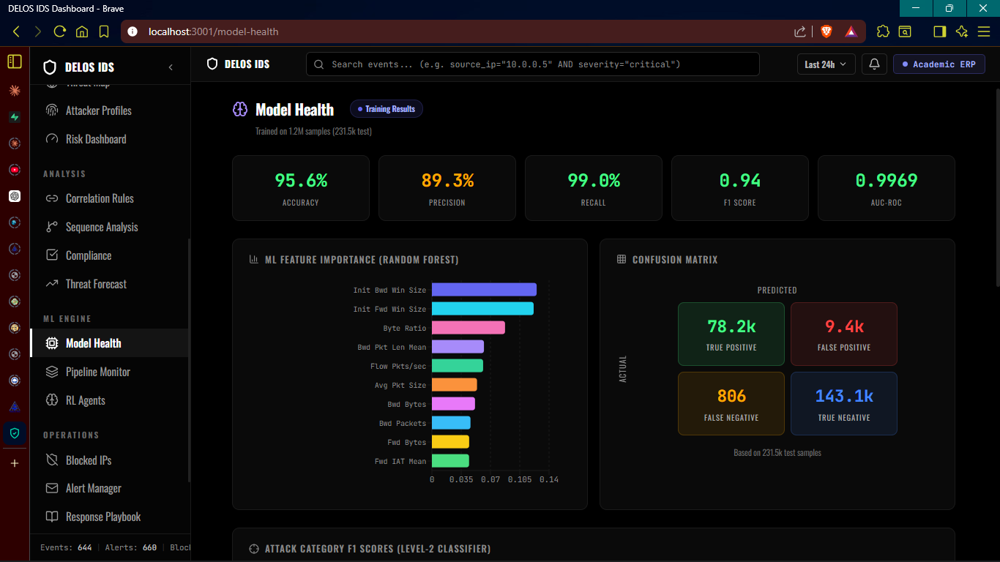
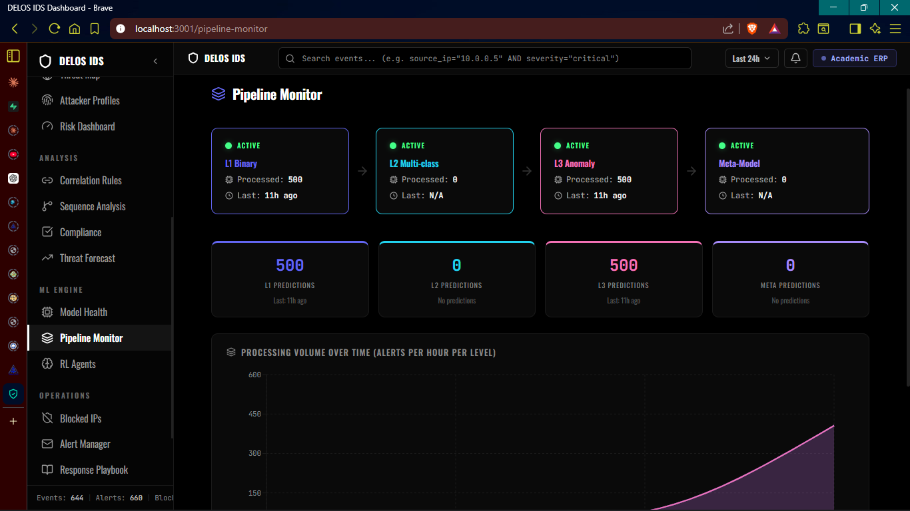

# Demo Walkthrough

This is the demo flow I use to explain the project in interviews or reviews.

## 1. Explain the Problem

ERP systems hold high-value records such as student data, attendance, fees, grades, identity information, and admin actions. A normal ERP backend can authenticate users, but it often lacks real-time detection, correlation, and response.

## 2. Show the Architecture

Open the architecture diagram and explain the separation between:

- ERP portal
- Middleware gateway
- ERP API
- IDS service
- Admin dashboard
- Persistence layer

## 3. Show Normal ERP Usage

Use the ERP student dashboard to show that the protected application is realistic and not only a security dashboard.

## 4. Explain Prevention

Show the blocked login flow and explain that risky sources can be stopped before reaching protected ERP workflows.

## 5. Show SOC Monitoring

Open the security posture and incident views. Explain how alerts become incidents and how operators can inspect severity, source IPs, event counts, and timelines.

## 6. Explain Analysis Views

Use sequence analysis, attacker profiles, and sessions to explain investigation workflows.

## 7. Show Model and Pipeline Visibility

Use model health and pipeline monitor screens to show that the ML system is observable.

## 8. Close With Engineering Tradeoffs

Key tradeoffs to discuss:

- Middleware centralization gives strong visibility but must be highly reliable.
- ML should support detection decisions, not replace deterministic security controls.
- Risk scoring needs explainability so operators can trust the system.
- False positives need feedback and review flows.
- Production use would require stronger secret handling, CI, monitoring, and policy enforcement.
