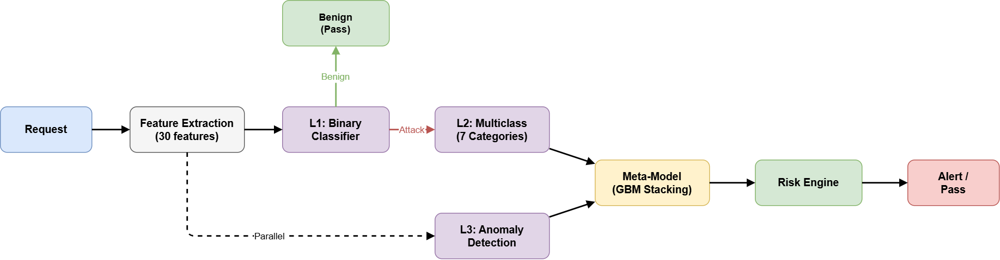
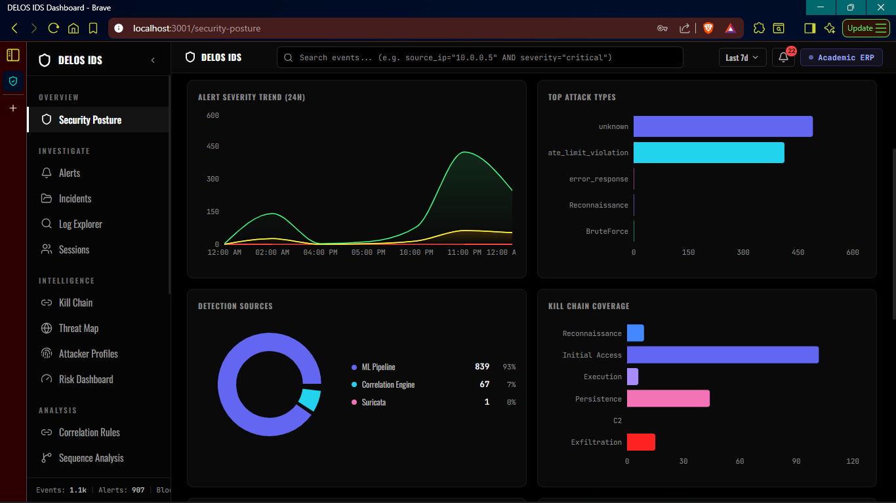

# Security Design

The project uses defense in depth around a protected ERP application.

## Main Security Controls

| Control | Purpose |
| --- | --- |
| Middleware gateway | Centralizes inspection before ERP APIs are reached |
| WAF-style checks | Detects suspicious payloads and common web attack patterns |
| Adaptive rate limiting | Adjusts behavior based on source risk and request patterns |
| IP blocking | Prevents high-risk sources from continuing into ERP flows |
| ML detection | Classifies suspicious behavior and anomaly signals |
| Risk scoring | Combines endpoint sensitivity, source behavior, and detection results |
| Incident correlation | Groups related detections into investigation records |
| Admin dashboard | Gives operators visibility into alerts, sessions, incidents, and models |

## Detection Pipeline

The IDS pipeline is structured around multiple detection layers:

1. Fast request inspection for obvious suspicious patterns.
2. Binary attack detection.
3. Multiclass attack categorization.
4. Anomaly scoring.
5. Meta decision and threshold-based response.
6. Incident and risk updates.

## Admin Visibility

The dashboard focuses on operational security visibility: trends, severity distribution, detection sources, kill-chain coverage, model status, pipeline activity, and session-level behavior.

## Hardening Considerations

If this system were prepared for production, the next hardening steps would include:

- Rotate all demo credentials and secrets.
- Move secrets into a secret manager.
- Enforce HTTPS and production CORS rules.
- Add CI checks for backend tests, frontend builds, dependency scanning, and secret scanning.
- Store model artifacts in a controlled registry.
- Add stronger authentication and authorization for sensitive IDS/admin operations.
- Add structured logs, retention policy, and audit trails.
- Tune rate limits against realistic traffic.
- Use Kubernetes Secrets instead of plain configuration values.

## Why the Source Code Is Private

The full source contains backend implementation details, detection logic, schema structure, deployment layout, and security workflows. Publishing the full implementation would expose more than is necessary for portfolio review.

This public case study provides architecture, screenshots, and design explanation while keeping sensitive implementation details private.
